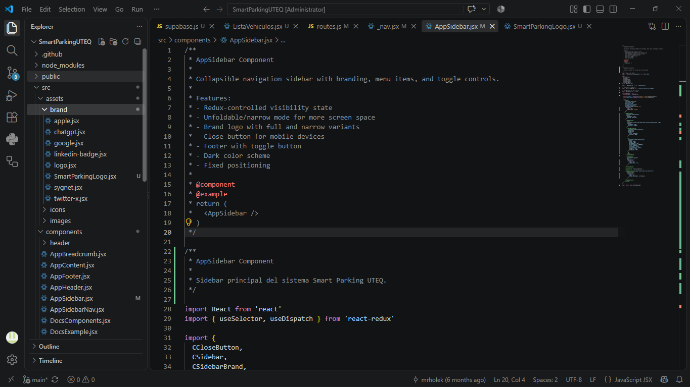
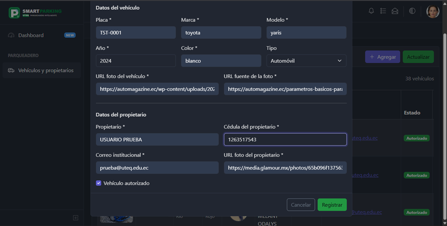
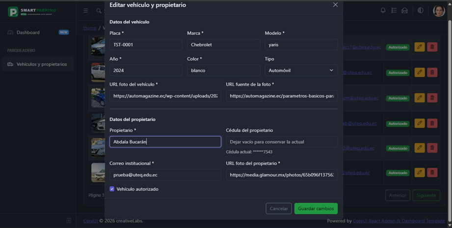
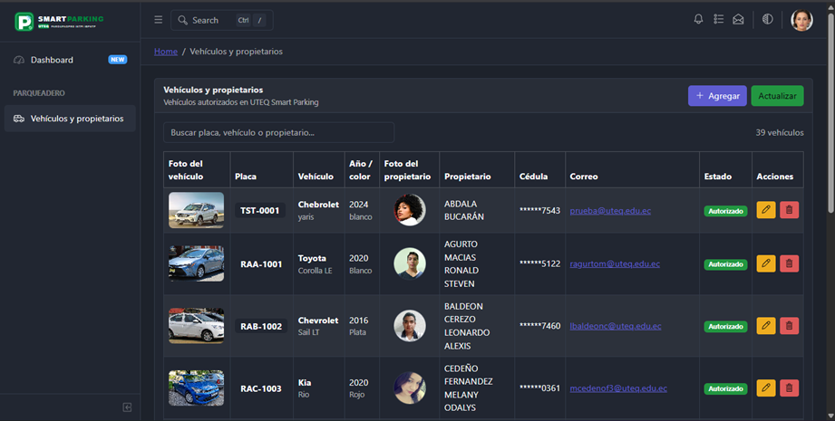
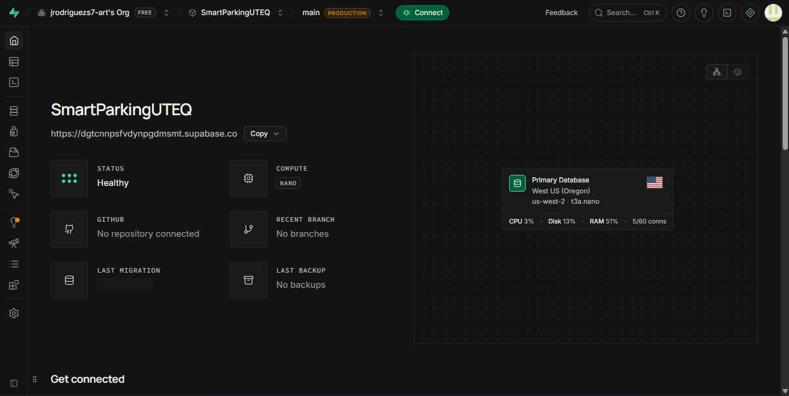
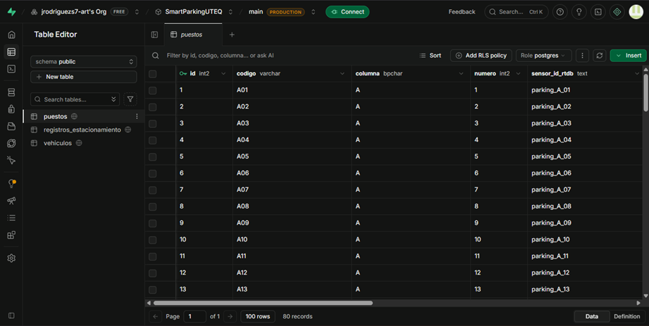
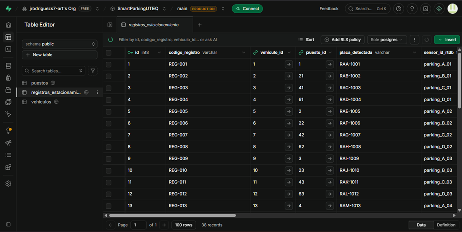
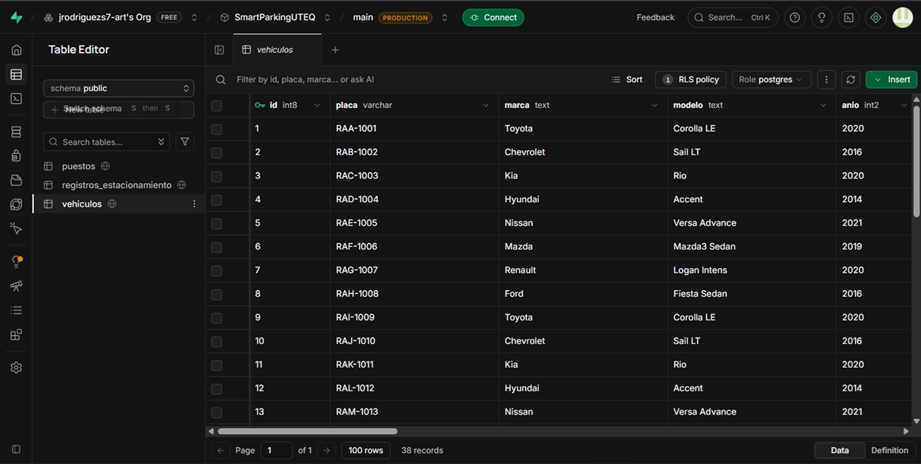

# Smart Parking UTEQ

Sistema web para la gestión de vehículos y propietarios del proyecto **Smart Parking UTEQ**. La aplicación fue desarrollada con **React**, **CoreUI** y **Supabase**, y permite consultar, registrar, editar y eliminar vehículos mediante una interfaz administrativa.

## Tecnologías utilizadas

- React
- CoreUI React Admin Template
- Supabase
- PostgreSQL
- JavaScript
- Vite
- Git y GitHub

## Estructura y configuración del proyecto

### Proyecto abierto en Visual Studio Code

La aplicación se trabaja desde Visual Studio Code, manteniendo los componentes, vistas, rutas y archivos de conexión organizados dentro del proyecto.



### Estructura principal

Los archivos incorporados para la funcionalidad de vehículos y propietarios se organizan principalmente de la siguiente manera:

```text
SmartParkingUTEQ/
├── .env.local
├── package.json
├── package-lock.json
└── src/
    ├── hooks/
    │   └── useVehiculos.js
    ├── lib/
    │   └── supabase.js
    ├── views/
    │   └── parqueadero/
    │       └── ListaVehiculos.jsx
    ├── _nav.jsx
    └── routes.js
```

## Interfaz principal

La vista **Vehículos y propietarios** presenta los registros almacenados en la base de datos. Desde esta pantalla se puede buscar información, consultar los datos de cada vehículo y propietario, actualizar la lista y acceder a las operaciones de registro, edición y eliminación.


## Registro de un nuevo vehículo

El botón **Agregar** abre un formulario para ingresar la información correspondiente al vehículo y a su propietario. Se solicitan datos como placa, marca, modelo, año, color, tipo, fotografías, nombre del propietario, cédula, correo institucional y estado de autorización.



## Funcionalidades CRUD

El módulo implementa las operaciones fundamentales para la administración de los registros:

- **Crear:** permite registrar un nuevo vehículo y su propietario.
- **Leer:** consulta y presenta los vehículos almacenados en Supabase.
- **Actualizar:** permite modificar la información de un registro existente.
- **Eliminar:** permite borrar un registro mediante una confirmación previa.

### Edición de registros

La opción de edición carga la información existente dentro del formulario para realizar los cambios necesarios. Por seguridad, la cédula se presenta enmascarada en la vista y puede conservarse sin necesidad de volver a ingresarla durante una edición.



### Registro creado

Después de registrar correctamente un vehículo, la información se actualiza y el nuevo elemento aparece dentro de la tabla de vehículos y propietarios.



### Eliminación de registros

Antes de eliminar un vehículo, el sistema muestra una ventana de confirmación con información básica del registro. De esta forma se reduce el riesgo de eliminar información accidentalmente.


## Base de datos con Supabase

Supabase se utiliza como servicio de base de datos para el proyecto. La aplicación React establece la conexión mediante `@supabase/supabase-js` y utiliza variables de entorno para mantener la configuración separada del código fuente.



La base de datos contiene las tablas principales `puestos`, `registros_estacionamiento` y `vehiculos`.

### Tabla `puestos`

Esta tabla almacena la información de los espacios disponibles en el parqueadero, incluyendo su código, columna, número e identificador relacionado con el sensor.



### Tabla `registros_estacionamiento`

Contiene los registros relacionados con la utilización de los puestos de estacionamiento y establece relaciones con vehículos y puestos.



### Tabla `vehiculos`

Almacena la información utilizada por el módulo de vehículos y propietarios, como placa, marca, modelo, año y los demás datos necesarios para la administración de cada registro.



## Instalación

Clona el repositorio:

```bash
git clone https://github.com/jrodriguezs7-art/SmartParkingUTEQ.git
```

Ingresa al proyecto:

```bash
cd SmartParkingUTEQ
```

Instala las dependencias:

```bash
npm install
```

Instala el cliente de Supabase si todavía no está incluido:

```bash
npm install --save-exact @supabase/supabase-js
```

## Configuración de Supabase

Crea un archivo `.env.local` en la raíz del proyecto:

```env
VITE_SUPABASE_URL=TU_URL_DE_SUPABASE
VITE_SUPABASE_PUBLISHABLE_KEY=TU_CLAVE_PUBLICA_DE_SUPABASE
```

> [!IMPORTANT]
> No publiques claves secretas ni una `service_role` en el repositorio. El archivo `.env.local` debe permanecer excluido mediante `.gitignore`.

La conexión se realiza desde `src/lib/supabase.js` utilizando las variables de entorno.

## Ejecución

Para iniciar el proyecto en modo de desarrollo:

```bash
npm start
```

Una vez iniciado, abre en el navegador la dirección indicada por Vite, normalmente:

```text
http://localhost:5173
```

## Características principales

- Consulta de vehículos y propietarios.
- Registro de nuevos vehículos.
- Edición de registros existentes.
- Eliminación con ventana de confirmación.
- Búsqueda por vehículo o propietario.
- Paginación de resultados.
- Visualización del estado de autorización.
- Cédula enmascarada en la tabla.
- Integración de React con Supabase.
- Interfaz administrativa basada en CoreUI.
- Diseño adaptable a diferentes tamaños de pantalla.

## Consideraciones de seguridad

La aplicación utiliza una clave pública de Supabase desde el frontend. Los permisos efectivos sobre los datos deben controlarse mediante los privilegios de PostgreSQL y las políticas de **Row Level Security (RLS)** configuradas en Supabase.

Para un entorno de producción se recomienda implementar autenticación y limitar las operaciones de inserción, actualización y eliminación únicamente a usuarios autorizados.

## Resultado

El proyecto proporciona una interfaz funcional para administrar los vehículos y propietarios de **Smart Parking UTEQ**. La integración entre React, CoreUI y Supabase permite mantener separadas la interfaz de usuario, la lógica de consulta y la persistencia de los datos, facilitando futuras ampliaciones del sistema.

## Autor

Proyecto académico **Smart Parking UTEQ**.
