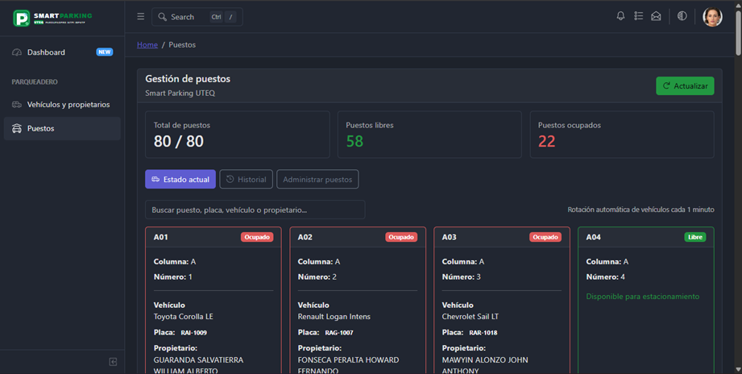
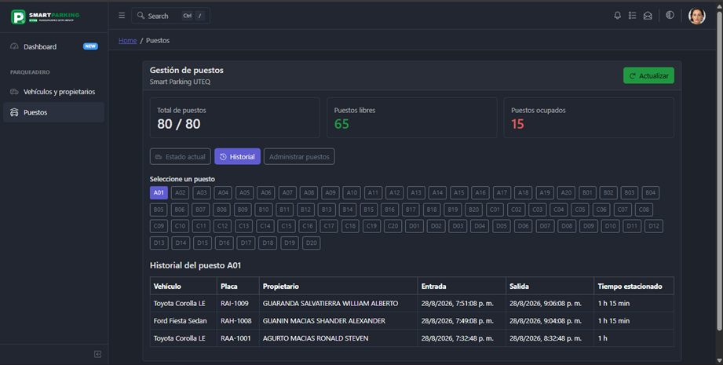
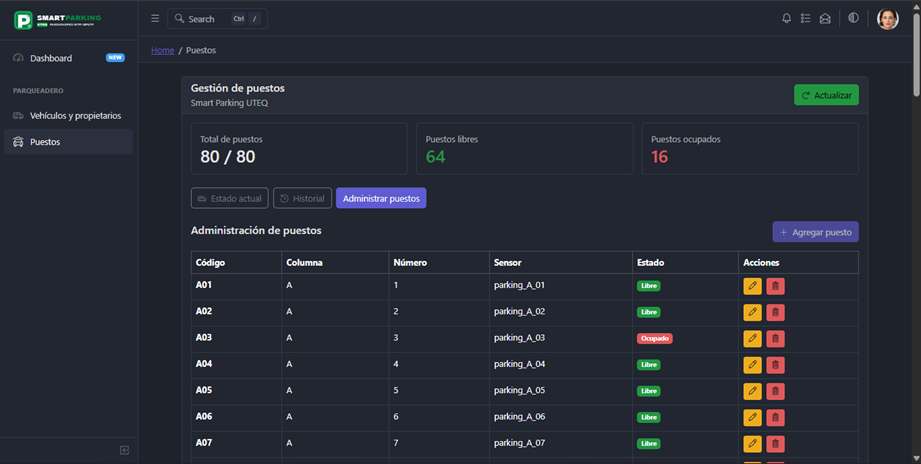
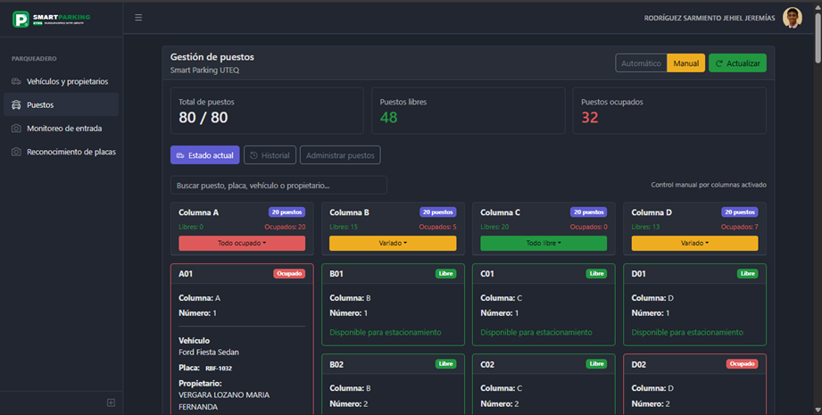
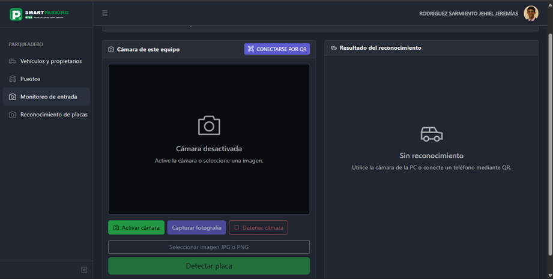
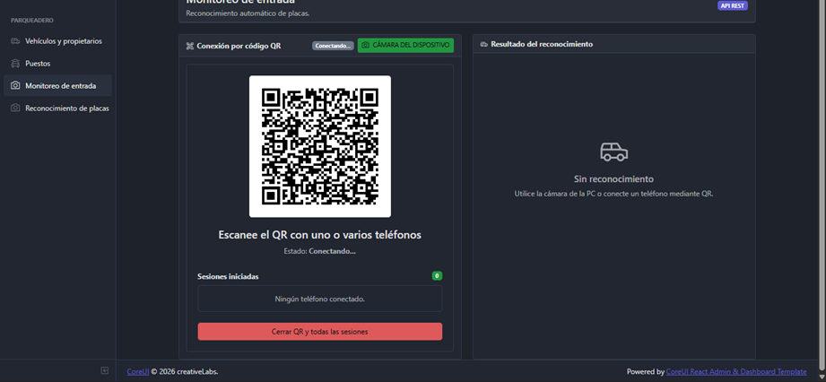
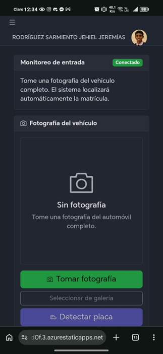
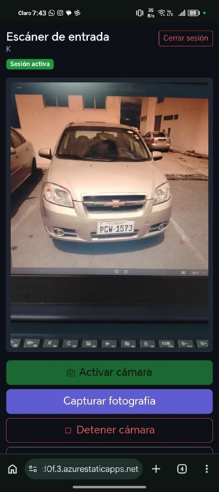
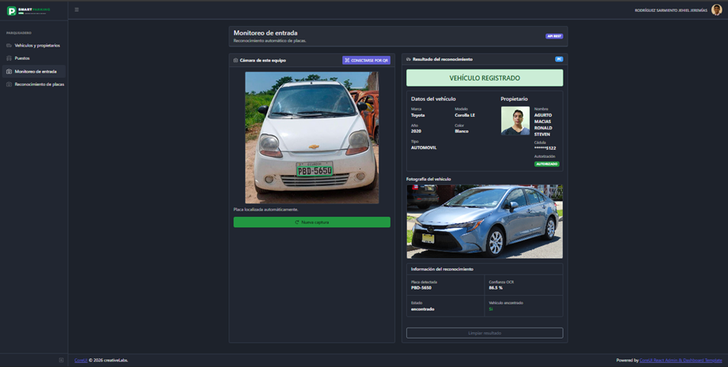
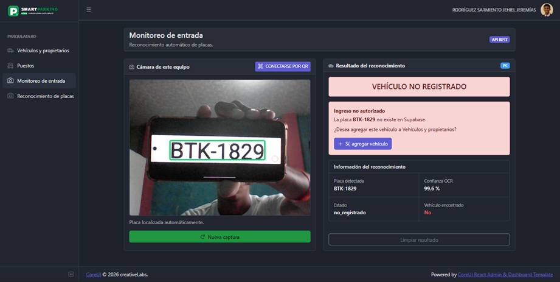

# Smart Parking UTEQ

Sistema web para la gestión de vehículos y propietarios del proyecto **Smart Parking UTEQ**. La aplicación fue desarrollada con **React**, **CoreUI** y **Supabase**, y permite consultar, registrar, editar y eliminar vehículos, administrar los puestos del parqueadero en tiempo real y reconocer placas vehiculares de forma automática mediante OCR.

## Tecnologías utilizadas

- React
- CoreUI React Admin Template
- Supabase
- PostgreSQL
- JavaScript
- Vite
- Azure Static Web Apps
- Azure Functions (API de reconocimiento OCR)
- Git y GitHub

## Estructura y configuración del proyecto

### Proyecto abierto en Visual Studio Code

La aplicación se trabaja desde Visual Studio Code, manteniendo los componentes, vistas, rutas y archivos de conexión organizados dentro del proyecto.


### Estructura principal

```text
SmartParkingUTEQ/
│
├── .github/
│   └── workflows/
│       ├── azure-static-web-apps-black-wave-0c6e08d0f.yml
│       └── npm.yml
│
├── api/
│   ├── ocr/
│   │   ├── function.json
│   │   └── index.js
│   ├── host.json
│   └── package.json
│
├── public/
│
├── src/
│   │
│   ├── assets/
│   │   └── images/
│   │       └── avatars/
│   │           ├── 8.jpeg
│   │
│   ├── components/
│   │   ├── header/
│   │   │   ├── AppHeaderDropdown.jsx
│   │   │   └── index.js
│   │   │
│   │   ├── AppBreadcrumb.jsx
│   │   ├── AppContent.jsx
│   │   ├── AppFooter.jsx
│   │   ├── AppHeader.jsx
│   │   ├── AppSidebar.jsx
│   │   ├── AppSidebarNav.jsx
│   │   └── index.js
│   │
│   ├── hooks/
│   │   ├── usePuestos.js
│   │   └── useVehiculos.js
│   │
│   ├── layout/
│   │   └── DefaultLayout.jsx
│   │
│   ├── lib/
│   │   ├── ocr/
│   │   │   └── ocrApi.js
│   │   └── supabase.js
│   │
│   ├── scss/
│   │
│   ├── views/
│   │   │
│   │   └── parqueadero/
│   │       │
│   │       ├── ListaVehiculos.jsx
│   │       ├── Puestos.jsx
│   │       │
│   │       ├── monitoreo/
│   │       │   ├── MonitoreoEntrada.jsx
│   │       │   └── MonitoreoEntradaMovil.jsx
│   │       │
│   │       └── reconocimiento/
│   │           ├── ReconocimientoPlacas.jsx
│   │           └── ReconocimientoMovil.jsx
│   │
│   ├── App.jsx
│   ├── _nav.jsx
│   ├── index.jsx
│   ├── routes.js
│   └── store.js
```

## Interfaz principal

La vista **Vehículos y propietarios** presenta los registros almacenados en la base de datos. Desde esta pantalla se puede buscar información, consultar los datos de cada vehículo y propietario, actualizar la lista y acceder a las operaciones de registro, edición y eliminación.


## Registro de un nuevo vehículo

El botón **Agregar** abre un formulario para ingresar la información correspondiente al vehículo y a su propietario. Se solicitan datos como placa, marca, modelo, año, color, tipo, fotografías, nombre del propietario, cédula, correo institucional y estado de autorización.


## Funcionalidades CRUD

El módulo implementa las operaciones fundamentales para la administración de los registros:

- **Crear:** permite registrar un nuevo vehículo y su propietario.
- **Leer:** consulta y presenta los vehículos almacenados en Supabase.
- **Actualizar:** permite modificar la información de un registro existente.
- **Eliminar:** permite borrar un registro mediante una confirmación previa.

### Edición de registros

La opción de edición carga la información existente dentro del formulario para realizar los cambios necesarios. Por seguridad, la cédula se presenta enmascarada en la vista y puede conservarse sin necesidad de volver a ingresarla durante una edición.


### Registro creado

Después de registrar correctamente un vehículo, la información se actualiza y el nuevo elemento aparece dentro de la tabla de vehículos y propietarios.


### Eliminación de registros

Antes de eliminar un vehículo, el sistema muestra una ventana de confirmación con información básica del registro. De esta forma se reduce el riesgo de eliminar información accidentalmente.


## Gestión de puestos

El módulo **Puestos** permite visualizar y administrar los espacios del parqueadero en tiempo real, así como consultar el historial de uso de cada puesto.

### Estado actual

Muestra el total de puestos disponibles, cuántos están libres y ocupados, junto con el detalle del vehículo y propietario asignado a cada puesto ocupado. Los datos se actualizan automáticamente conforme rota el uso de los vehículos.



### Historial

Permite seleccionar un puesto específico y consultar el historial de vehículos que lo han utilizado, incluyendo hora de entrada, hora de salida y tiempo total estacionado.



### Administrar puestos

Desde esta sección se listan todos los puestos con su código, columna, número, sensor asociado y estado actual, permitiendo agregar, editar o eliminar puestos.



### Control manual por columnas

Además del modo automático, la vista de **Gestión de puestos** incorpora un modo **Manual** que permite controlar el estado de cada columna de forma independiente. Cada columna (A, B, C, D) muestra su cantidad de puestos libres y ocupados, y ofrece un selector rápido con las opciones **Todo ocupado**, **Variado** y **Todo libre** para actualizar el estado de todos sus puestos a la vez. También se puede consultar el detalle individual de cada puesto (vehículo, placa y propietario asignado cuando está ocupado, o disponibilidad cuando está libre).



## Monitoreo de entrada y reconocimiento automático de placas

El módulo **Monitoreo de entrada** permite detectar automáticamente la placa de un vehículo que ingresa al parqueadero mediante OCR, verificar si el vehículo está registrado en la base de datos y mostrar su información en tiempo real.

### Cámara del equipo

Desde la pantalla principal se puede activar la cámara del computador, capturar una fotografía o seleccionar una imagen en formato JPG o PNG para detectar la placa del vehículo.



### Conexión por código QR

Como alternativa a la cámara del equipo, el sistema genera un código QR que permite conectar la cámara de uno o varios teléfonos móviles al monitoreo de entrada. Esto habilita el uso de dispositivos móviles como cámaras remotas para el reconocimiento de placas.



### Uso desde el teléfono móvil

Al escanear el código QR, el teléfono se conecta a la sesión de monitoreo y muestra una interfaz simplificada donde se puede tomar una fotografía del vehículo completo, seleccionar una imagen de la galería o enviarla directamente para su detección.



Una vez capturada la fotografía, el vehículo y su placa quedan visibles en la vista previa del teléfono antes de procesar el reconocimiento.



### Resultado del reconocimiento — vehículo registrado

Cuando la placa detectada corresponde a un vehículo existente en Supabase, el sistema muestra el mensaje **Vehículo registrado** junto con los datos del vehículo (marca, modelo, año, color, tipo), la información del propietario, la fotografía registrada, la placa detectada y el porcentaje de confianza del OCR.



### Resultado del reconocimiento — vehículo no registrado

Si la placa detectada no existe en la base de datos, el sistema muestra el mensaje **Vehículo no registrado**, indica que el ingreso no está autorizado y ofrece la opción de agregar directamente el vehículo al módulo de **Vehículos y propietarios** desde el mismo resultado del reconocimiento.



## Base de datos con Supabase

Supabase se utiliza como servicio de base de datos para el proyecto. La aplicación React establece la conexión mediante `@supabase/supabase-js` y utiliza variables de entorno para mantener la configuración separada del código fuente.


La base de datos contiene las tablas principales `puestos`, `registros_estacionamiento` y `vehiculos`.

### Tabla `puestos`

Esta tabla almacena la información de los espacios disponibles en el parqueadero, incluyendo su código, columna, número e identificador relacionado con el sensor.


### Tabla `registros_estacionamiento`

Contiene los registros relacionados con la utilización de los puestos de estacionamiento y establece relaciones con vehículos y puestos.


### Tabla `vehiculos`

Almacena la información utilizada por el módulo de vehículos y propietarios, como placa, marca, modelo, año y los demás datos necesarios para la administración de cada registro.


## Instalación

Clona el repositorio:

```bash
git clone https://github.com/jrodriguezs7-art/SmartParkingUTEQ.git
```

Ingresa al proyecto:

```bash
cd SmartParkingUTEQ
```

Instala las dependencias:

```bash
npm install
```

Instala el cliente de Supabase si todavía no está incluido:

```bash
npm install --save-exact @supabase/supabase-js
```

## Configuración de Supabase

Crea un archivo `.env.local` en la raíz del proyecto:

```env
VITE_SUPABASE_URL=TU_URL_DE_SUPABASE
VITE_SUPABASE_PUBLISHABLE_KEY=TU_CLAVE_PUBLICA_DE_SUPABASE
```

> [!IMPORTANT]
> No publiques claves secretas ni una `service_role` en el repositorio. El archivo `.env.local` debe permanecer excluido mediante `.gitignore`.

La conexión se realiza desde `src/lib/supabase.js` utilizando las variables de entorno.

## Ejecución

Para iniciar el proyecto en modo de desarrollo:

```bash
npm start
```

Una vez iniciado, abre en el navegador la dirección indicada por Vite, normalmente:

```text
http://localhost:5173
```

## Características principales

- Consulta de vehículos y propietarios.
- Registro de nuevos vehículos.
- Edición de registros existentes.
- Eliminación con ventana de confirmación.
- Búsqueda por vehículo o propietario.
- Paginación de resultados.
- Visualización del estado de autorización.
- Cédula enmascarada en la tabla.
- Gestión de puestos en tiempo real, con modo automático y modo manual por columnas.
- Historial de uso de cada puesto de estacionamiento.
- Monitoreo de entrada con reconocimiento automático de placas (OCR).
- Conexión de la cámara del teléfono mediante código QR para el monitoreo de entrada.
- Verificación automática de vehículos registrados y no registrados al ingreso.
- Integración de React con Supabase.
- Interfaz administrativa basada en CoreUI.
- Diseño adaptable a diferentes tamaños de pantalla.

## Consideraciones de seguridad

La aplicación utiliza una clave pública de Supabase desde el frontend. Los permisos efectivos sobre los datos deben controlarse mediante los privilegios de PostgreSQL y las políticas de **Row Level Security (RLS)** configuradas en Supabase.

Para un entorno de producción se recomienda implementar autenticación y limitar las operaciones de inserción, actualización y eliminación únicamente a usuarios autorizados.

## Resultado

El proyecto proporciona una interfaz funcional para administrar los vehículos, propietarios y puestos de **Smart Parking UTEQ**, así como un módulo de monitoreo de entrada con reconocimiento automático de placas. La integración entre React, CoreUI, Supabase y el servicio de OCR permite mantener separadas la interfaz de usuario, la lógica de consulta y la persistencia de los datos, facilitando futuras ampliaciones del sistema.

## Autor

Proyecto académico **Smart Parking UTEQ**.
